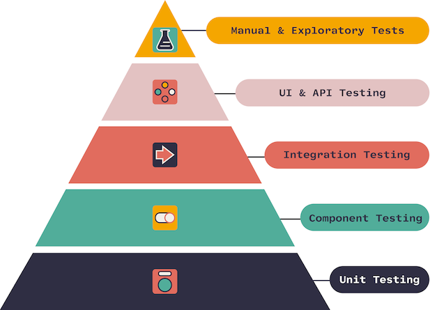

# Вопросы к экзамену&emsp;&emsp;&emsp;&emsp;

### 1. Что такое микросервисная архитектура? Плюсы и минусы по сравнению с монолитом.
&emsp;&emsp;&emsp;&emsp;Микросервисная архитектура — это подход к разработке программного обеспечения, при котором приложение состоит из множества небольших, независимых сервисов, каждый из которых выполняет свою конкретную задачу. Эти сервисы взаимодействуют друг с другом через API и могут быть развернуты и масштабированы независимо.
- Плюсы микросервисной архитектуры:
    - Масштабируемость.
    - Гибкость (Разнообразие технологий).
    - Устойчивость.
    - Быстрая доставка.
    - Упрощение разработки.
- Минусы микросервисной архитектуры:
    - Система должна работать быстро, т.к. теперь ко времени выполнения самих операций требуется прибавлять время взаимодействия по сети.
    - Нужно иметь хорошую систему деплоя и развертывания новых виртуальных машин, т.к. количество сервисов будет расти и настройка всего окружения вручную будет проблематична.
    - Требуется хорошее описание внешнего API.
    - С появлением большого количество сетевого трафика накладывается большая ответственность на сеть и отказоустойчивость оборудования.
    - В связи с этим, нужно при проектировании программы обязательно обрабатывать недоступность и ошибки от внешней системы.
    - Часто становится очень трудно разбить систему на сервисы из-за сильной связанности данных.
### 2. Критерии качества микросервисной архитектуры: слабая связность и сопряженность.
&emsp;&emsp;&emsp;&emsp;Слабая связность означает, что сервисы должны быть максимально независимыми друг от друга. Это позволяет изменять и масштабировать каждый сервис отдельно без влияния на другие части системы. Для достижения слабой связности рекомендуется использовать четкие API для взаимодействия между сервисами.
- Связанность содержимого (один модуль изменяет или полагается на внутренние особенности другого модуля).
- Связанность через общее (два модуля работают с общими данными).
- Связанность через внешнее (два модуля используют навязанный извне формат данных, протокол связи и т.д.).
- Связанность по управлению (один модуль управляет поведением другого).
- Связанность по структурированным данным (Модули используют одну и ту же структуру, но каждый использует только ее части).
- Связанность через данных (модули совместно используют данные, например, через параметры).
- Связанность по сообщениям (модули общаются только через передачу параметров или сообщений).
- Отсутствие связанности

&emsp;&emsp;&emsp;&emsp;Сопряженность характеризует то, насколько хорошо все методы класса или все фрагменты метода соответствуют главной цели, — иначе говоря, насколько сфокусирован класс. Считается, что объект (подсистема) обладает высокой сопряженностью (High Cohesion), если его обязанности хорошо согласованы между собой и он не выполняет огромных объемов работы.
- Случайная (Coincidental Cohesion) – части модуля сгруппированы случайным образом, единственное, что их объединяет — сам модуль.
- Логическая (Logical Cohesion) – части модуля логически относятся к одной проблеме, при этом части могут различаться по своей природе.
- Временная (Temporal Cohesion) – части модуля обычно используются в программе в одно время, рядом.
- Процедурная (Procedural Cohesion) – части модуля всегда используются в определенном порядке.
- По взаимодействию (Communication Cohesion) – части модуля работают над одним и теми же данными.
- По последовательности действий (Sequential Cohesion) – результат работы одной части модуля является исходными данными для другой.
- Функциональная (Functional Cohesion) – части модуля направлены на решение одной четкой задачи, за которую отвечает модуль.

### 3. Проектирование микросервисов: декомпозиция по бизнес возможностям и Domain Driven Design. Что такое Bounded Context и чем он отличается от бизнес-сущности.
&emsp;&emsp;&emsp;&emsp; Один из самых очевидных способов декомпозиции задачи на микросервисы – это разбиение по бизнес-возможностям. В приложении описываются все функции и на их основе выделяются сервисы, инкапсулирующие в себе работу с этими бизнес-функциями. Другими словами – в этом подходе микросервис отвечает за законченную бизнес-функциональность.

&emsp;&emsp;&emsp;&emsp;DDD (проблемно-ориентированное проектирование) основано на подходе, при котором классы моделируются на основе реальных бизнес процессов. В контексте создания приложений DDD рассматривает проблемы как домены (предметные области). Этот подход описывает независимые проблемные области как ограниченные контексты (каждый ограниченный контекст соответствует микросервису). У каждого домена своя модель данных, область действия которой принято называть ограниченным контекстом (Bounded Context). Каждый микросервис будет разрабатываться внутри этого ограниченного контекста. Основная задача при использовании DDD-подхода — подобрать поддомены и границы между ними так, чтобы они были максимально независимы друг от друга.

&emsp;&emsp;&emsp;&emsp;Bounded Context – это граница, внутри которой существует модель предметной области. При правильном разделении, границы этих областей будут слабо связаны друг с другом, тем самым изменения в одном контексте будет оказывать минимальное влияние на другие.

&emsp;&emsp;&emsp;&emsp;Отличие между Bounded Context и бизнес-сущностью заключается в следующем:

1. **Bounded Context**: Это концепция, описывающая локальную сферу действия, где определенный язык моделирования согласован и работает эффективно. Bounded Context помогает управлять сложностью и согласовывать модели в разделенных контекстах.

2. **Бизнес-сущность**: Это конкретный объект или концепция в предметной области бизнеса, который имеет уникальную идентичность и значимость для бизнес-процессов. Бизнес-сущности описывают реальные элементы или процессы, с которыми работает предметная область.
### 4. Маршрутизация в сети интернет.
### 5. Протокол TCP. Гарантия доставки. Flow Control и Congestion Control.
### 6. Отказоустойчивость на сетевом уровне.
### 7. Протокол HTTP. HTTPS. HTTP/2.
&emsp;&emsp;&emsp;&emsp;Протокол HTTP (Hypertext Transfer Protocol) - стандартный протокол передачи данных в сети Интернет. Он используется для передачи информации между веб-серверами и клиентскими браузерами. HTTP работает поверх протокола TCP и использует порт 80 для связи.

&emsp;&emsp;&emsp;&emsp;Протокол HTTPS (Hypertext Transfer Protocol Secure) - это защищенная версия протокола HTTP, которая обеспечивает шифрование передаваемых данных между клиентом и сервером. HTTPS использует шифрование SSL/TLS для защиты конфиденциальности данных и обеспечения целостности информации. HTTPS работает на порту 443.

&emsp;&emsp;&emsp;&emsp;Протокол HTTP/2 - это новая версия протокола HTTP, разработанная для улучшения производительности передачи данных в Интернете. HTTP/2 предлагает новые возможности, такие как мультиплексирование (одновременная передача нескольких запросов на одном соединении), сжатие заголовков запросов, приоритизацию запросов и другие оптимизации. HTTP/2 обеспечивает более эффективную передачу данных по сравнению с предыдущей версией HTTP/1.1, что улучшает производительность веб-сайтов и веб-приложений.
### 8. Угрозы в сети. DDoS, XSS, CSRF, Man-In-The-Middle. Что такое CORS?
&emsp;&emsp;&emsp;&emsp;DDoS-атака (Denial of Service) - Закидывание неугодных ресурсов различным флудом, приводящее их к нокдауну. Если атака выполняется одновременно с большого числа компьютеров, говорят о DDoS-атаке (Distributed Denial of Service). Классификация:
- HTTP-флуд
- UDP-флуд
- ICMP-флуд
- SYN-флуд
- Отраженная атака

&emsp;&emsp;&emsp;&emsp;XSS атаки – представляет собой уязвимость web-приложений, которая позволяет внедрение вредоносного кода в WEB-страницы, просматриваемые другими пользователями. XSS атаки - это атаки не на сам сайт, а на пользователей сайта. Чаще всего XSS используют для кражи Cookies, т.к. в них иногда хранят какую-нибудь ценную информацию (иногда даже логин и пароль (или его хэш) пользователя), но самой опасной является кража активной сессии.
Существует два типа XSS уязвимостей — пассивная и активная.
- Пассивные - это XSS, которые требуют от жертвы непосредственного участия. Например, заставить пользователя перейти по ссылке: ```http://www.site.com/page.php?var=<script>document.cookie</script>```.
- Активные - это XSS, которые, не требуют никаких дополнительных действий со стороны жертвы – ей достаточно лишь открыть страницу с вашим XSS и js выполнится автоматически.

&emsp;&emsp;&emsp;&emsp;Атака посредника или атака Man in the middle (MITM) — вид атаки в криптографии, когда злоумышленник перехватывает и подменяет сообщения, которыми обмениваются корреспонденты, причём ни один из последних не догадывается о его присутствии в канале. Используется для прослушки или подмены передаваемых сообщений.

&emsp;&emsp;&emsp;&emsp;CSRF - это тип атаки на веб-приложения, когда злоумышленник заставляет авторизованного пользователя выполнить нежелательные действия на веб-сайте, на котором пользователь уже аутентифицирован. Атака CSRF обычно выполняется путем отправки поддельных HTTP-запросов от имени жертвы без ее ведома.

&emsp;&emsp;&emsp;&emsp;CORS - это механизм в веб-браузерах, который позволяет веб-страницам запрашивать ресурсы с другого источника (домена), чем тот, с которого была загружена текущая страница. CORS введен для обеспечения безопасности и защиты от атак, связанных с межсайтовыми запросами (Cross-Site Request Forgery, CSRF, и другие).
### 9. OAuth2, OpenID Connect, JWT, JWKs.
### 10. Масштабирование и балансировка back-end’ов.
### 11. Кэширование.
### 12. Отказоустойчивость при межсервисных вызовах. Причины отказов в обслуживании.
### 13. RESTful. Пример. 
&emsp;&emsp;&emsp;&emsp;RESTful (Representational State Transfer) - это архитектурный стиль, используемый для разработки веб-сервисов, который определяет набор ограничений и правил для построения распределенных систем. 

&emsp;&emsp;&emsp;&emsp;Основными или наиболее часто используемыми HTTP методами являются POST (создание) , GET (чтение), PUT, PATCH (обновление) и DELETE (удаление), что в совокупности дает CRUD.
- GET используется для получения (или чтения) представления ресурса.
- POST запрос наиболее часто используется для создания новых ресурсов.
- PUT метод обычно используется для предоставления возможности обновления ресурса.
- PATCH метод служит для модификации существующего ресурса.
- DELETE используется для удаления ресурса, идентифицированного конкретным ID.
### 14. Асинхронное взаимодействие сервисов. Идемпотентность запросов.
### 15. Очереди. At most once, at least once политики доставки.
### 16. Теорема CAP.
### 17. Протокол RAFT.
### 18. Протокол PAXOS.
### 19. Event Driven Architecture.
### 20. Оркеструемая и хореографическая SAGA.
### 21. Транзакции. ACID. Оптимистичная и пессимистичные блокировки.
### 22. Write ahead log. Связь с транзакциями.
### 23. RAID. Репликация.
### 24. Шардирование и партиционирование. Решардинг.
### 25. Service Discovery. Балансировка запросов: Client Side и Server Side Load balancing.
### 26. Gateway API. Зачем нужен, какие проблемы решает.
&emsp;&emsp;&emsp;&emsp;Шлюз API находится между клиентами и службами, он выполняет функцию обратного прокси, передавая запросы от клиентов к сервисам. Также он может выполнять такие специализированные задачи, как аутентификация, SSL-терминация и Rate Limiting (ограничение числа запросов).

&emsp;&emsp;&emsp;&emsp;Для публичных сервисов есть ряд задач, которые они должны уметь решать:
- SSL-termination.
- Аутентификация.
- Back-List и White-List IP адресов.
- Rate Limit.
- Request Logging, Monitoring.
- Кэширование ответов, GZIP для сжатия ответов, отдача статики.

&emsp;&emsp;&emsp;&emsp;Функции Gateway API можно сгруппировать в соответствии со следующими задачами:
- Gateway Routing.
- Aggregation Gateway.
- Offloading Gateway.
- Контроль пропускной способности сервиса.

### 27. Паттерн Circuit Breaker.
&emsp;&emsp;&emsp;&emsp;Шаблон проектирования Circuit Breaker используется для устранения избыточной нагрузки на систему в случае недоступности одной из его компонентов. Паттерн Circuit Breaker рассчитан на менее ожидаемые ошибки, которые могут длиться намного дольше: обрыв сети, отказ сервиса, оборудования.

&emsp;&emsp;&emsp;&emsp;У Circuit Breaker есть три состояния:
1. Closed: Запрос приложения перенаправляется на операцию. Прокси-сервер ведет подсчет числа недавних сбоев, и если вызов операции не завершился успешно, прокси-сервер увеличивает это число. Если число недавних сбоев превышает заданный порог в течение заданного периода времени, прокси-сервер переводится в состояние Открытый. На этом этапе прокси-сервер запускает таймер времени ожидания, и по истечении времени этого таймера прокси-сервер переводится в состояние Half-Open. Назначение таймера — дать сервису время для решения проблемы, прежде чем разрешить приложению попытаться выполнить операцию еще раз.
2. Open: запрос от приложения немедленно завершает с ошибкой и исключение возвращается в приложение.
3. Half-Open: Ограниченному числу запросов от приложения разрешено проходить через операцию и вызывать ее. Если эти запросы выполняются успешно, предполагается, что ошибка, которая ранее вызывала сбой, устранена, а автоматический выключатель переходит в состояние Closed и счетчик сбоев сбрасывается. Если какой-либо запрос завершается со сбоем, автоматическое выключение предполагает, что неисправность все еще присутствует, поэтому он возвращается в состояние Open и перезапускает таймер времени ожидания, чтобы дать системе дополнительное время на восстановление после сбоя.

&emsp;&emsp;&emsp;&emsp;Состояние Half-Open помогает предотвратить быстрый рост запросов к сервису. Т.к. после начала работы сервиса, некоторое время он может быть способен обрабатывать ограниченное число запросов до полного восстановления.

&emsp;&emsp;&emsp;&emsp;Цель применения этого паттерна — дать системе время на исправление ошибки, которая вызвала сбой, прежде чем разрешить приложению попытаться выполнить операцию еще раз.

### 28. Хореографическая и оркестрируемая SAGA.
&emsp;&emsp;&emsp;&emsp;**Хореографическая Saga**

**Преимущества**:
- Хорошо подходит для простых рабочих процессов, требующих нескольких участников, и не требует логики координации.
- Не требует дополнительной реализации и обслуживания сервиса.
- Не вводит единую точку отказа, так как обязанности распределяются по участникам Saga.

**Недостатки**:
- Рабочий процесс может стать запутанным при добавлении новых шагов, так как трудно отслеживать, какие участники Saga прослушивают команды.
- Существует риск циклической зависимости между участниками Saga, поскольку они должны использовать команды друг друга.
- Тестирование интеграции значительно усложняется.

&emsp;&emsp;&emsp;&emsp;**Оркестрируемая Saga**: Оркестрация — это способ координации, когда централизованный контроллер сообщает участникам Saga, какие локальные транзакции следует выполнить. Saga Orchestrator обрабатывает все транзакции и сообщает участникам, какая операция должна выполняться на основе событий. Orchestrator выполняет запросы Saga, сохраняет и интерпретирует состояния каждой задачи, а также выполняет восстановление после сбоя с помощью компенсирующих транзакций.


**Преимущества**:
- Хорошо подходит для сложных рабочих процессов, в которых участвуют многие участники или новые участники, добавленные с течением времени.
- Подходит, если существует контроль над каждым участником процесса и управление потоком действий.
- Не вводит циклические зависимости, так как все участники Saga зависят от Оркестратора.
- Участникам Saga не нужно знать о командах для других участников. Четкое разделение проблем упрощает бизнес-логику.

**Недостатки**:
- Дополнительная сложность проектирования требует реализации логики координации.
- Есть дополнительная точка отказа, так как Оркестратора управляет полным рабочим процессом.

### 29. Docker. Docker Compose. Сетевое взаимодействие между контейнерами и с host–машиной.
&emsp;&emsp;&emsp;&emsp;Docker - это средство виртуализации, одно из назначений которого виртуализация рабочих сред на серверах. Также он предоставляет универсальный способ доставки приложений на машины (локальный компьютер или удаленные сервера) и их запуска в изолированном окружении.

&emsp;&emsp;&emsp;&emsp;Docker Compose — это инструментальное средство, входящее в состав Docker. Оно предназначено для решения задач, связанных с развёртыванием проектов. Технология Docker Compose, позволяет, с помощью одной команды, запускать множество сервисов. Docker Compose используется для одновременного управления несколькими контейнерами, входящими в состав приложения. Этот инструмент предлагает те же возможности, что и Docker, но позволяет работать с более сложными приложениями.

&emsp;&emsp;&emsp;&emsp;При запуске docker-процесса, он создает новый виртуального интерфейс типа bridge с названием docker0 в host-системе. Этот интерфейс позволяет docker создать виртуальную подсеть для использования контейнерами, которые он будет запускать. Мост будет служить основной точкой взаимодействия между сетью внутри контейнера и сетью хоста.

&emsp;&emsp;&emsp;&emsp;Для взаимодействия между контейнерами нужно создать между ними сеть. Есть несколько основных видов сетей:
- bridge – сеть типа мост для взаимодействия между контейнерами.
    - По-умолчанию, docker создает дефолтную bridge сеть между всеми контейнерами, но она не предоставляет resolv DNS, соответственно, общение между контейнерами требуется выполнять с помощью ip-адресов.
    - Если создается user-defined сеть, то внутри можно обращаться по имени контейнера (DNS resolution).
- host – монтируется на сеть host-машины, порты внутри контейнера аллоцируются сразу на host машине. Работает только на Linux.
- macvlan – docker host принимает запросы на несколько MAC-адресов по своему ip-адресу и направляют эти запросы в соответствующий контейнер.
- overlay – создает покрывающую сеть между несколькими машинами с docker. Используется в Kubernetes.
### 30. Что такое оркестрация сервисов, зачем нужен k8s.
&emsp;&emsp;&emsp;&emsp;Оркестрация сервисов (Service Orchestration) - это концепция в архитектуре программного обеспечения, которая описывает процесс управления и координации выполнения различных сервисов или компонентов в рамках распределенной системы. Оркестрация сервисов позволяет создавать сложные бизнес-процессы путем комбинирования и управления выполнением отдельных сервисов или компонентов.

Основные принципы оркестрации сервисов включают:
1. Координация
2. Управление потоком данных и контроль выполнения
3. Обработка ошибок и исключений
4. Масштабируемость и гибкость

&emsp;&emsp;&emsp;&emsp;Kubernetes(k8s) — это портативная расширяемая платформа с открытым исходным кодом для управления контейнеризованными рабочими нагрузками и сервисами, которая облегчает как декларативную настройку, так и автоматизацию.

&emsp;&emsp;&emsp;&emsp;Kubernetes предоставляет:
- Мониторинг сервисов и распределение нагрузки
- Оркестрация хранилища 
- Автоматическое развертывание и откаты
- Автоматическое распределение нагрузки
- Самоконтроль
- Управление конфиденциальной информацией и конфигурацией

### 31. Типы сущностей в K8S, зачем они нужны.
&emsp;&emsp;&emsp;&emsp;Kubernetes — это портативная расширяемая платформа с открытым исходным кодом для управления контейнеризованными рабочими нагрузками и сервисами, которая облегчает как декларативную настройку, так и автоматизацию.

&emsp;&emsp;&emsp;&emsp;Основные объекты Kubernetes:
- Pod - минимальная сущность для развертывания в кластере. Каждый Pod предназначен для запуска одного (обычно) экземпляра конкретного приложения.
- Service - Абстракция, которая определяет логический набор подов и политику доступа к ним, как сетевой сервис. 
- Volumes - Персистентное хранилище данных внутри кластера. По-умолчанию используется emptyDir – volume создается на диске и существует до тех пор, пока Pod работает на этой ноде. ConfigMaps так же могут использоваться как volume для конфигурирования приложения.
- Namespace - это виртуальные кластеры размещенные поверх физического.
- Secrets - используются для хранения конфиденциальной информации.
- Deployment - обеспечивает декларативные обновления для Pods и ReplicaSets.
- DaemonSet - гарантирует, что определенный Pod будет запущен на всех нодах.
- StatefulSet - используется для управления приложениями с сохранением состояния.
- ReplicaSet - гарантирует, что определенное количество экземпляров Pod будет запущено в кластере в любой момент времени.
- Labels - используются для маркирования объектов кластера, а так же для выбора этих объектов.
- ConfigMaps - абстракция над файлами конфигурации, позволяет разделять настройки приложения и сами контейнеры, избавляя от необходимости упаковывать конфиги в docker-образ.
- Annotations - используются для добавления собственных метаданных к объектам.
### 32. Пирамида тестирования. Зачем нужны unit тесты и как их правильно писать.


- Unit-тесты – проверка отдельного класса программы.
- Сервисные тесты (Component Tests) – проверка, что изолированная система работает корректно (т.е. все внешние вызовы закрыты заглушками).
- Интеграционные тесты (Integration Tests) – тестирование контура с реальными запросами и ответами между системами.
- UI-тесты – проверка работы пользовательского интерфейса.
- Security tests – тестирование, направленное на выявление дырок в безопасности системы (как на уровне самого приложения, для уверенности в том, что эти изменения не внесли ошибки в областях, которые не подверглись изменениям. приложения, так и на уровне инфраструктуры).
- Регрессионное тестирование – тестирование уже проверенной ранее функциональности после внесения изменений в код.
- Нагрузочные тесты (стресс-тесты) – тестирование поведения системы под возрастающей нагрузкой.

&emsp;&emsp;&emsp;&emsp;**Unit-тесты** – важная составляющая программы, которая гарантирует работоспособность каждой части программы в отдельности. Главной задачей unit тестов является гарантия того, что при изменении кода результат его работы остается прежним, либо мы получаем новый ожидаемый результат. Т.к. unit-тесты в первую очередь нужны при рефакторинге и развитии кода, они не дают гарантии работоспособности всей системы в целом.
- Выявление ошибок
- Поддержание качества кода
- Облегчение рефакторинга
- Улучшение дизайна кода

&emsp;&emsp;&emsp;&emsp;Правильное написание unit-тестов включает в себя следующие практики:
- Независимость
- Полное покрытие
- Читаемость
- Быстродействие
- Поддержание